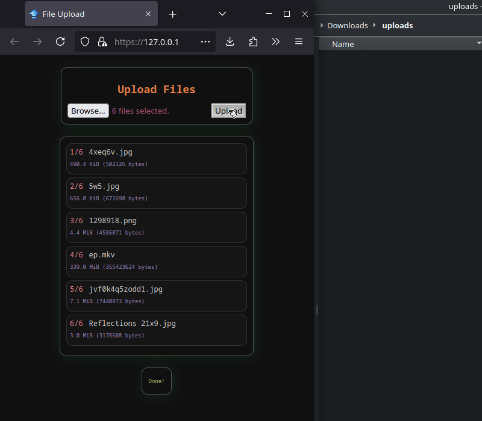

# dumpit - simple HTTP(s) file server for uploading files

[](http://www.python.org/download/)

Easily transfer files from a phone to a PC over wifi.



# Installation
```
./setup-env.sh
./install.sh
```

## Requirements
* flask
* pyopenssl
* flask_sslify

# Running
```
dumpit uploads
```
> uploads - dir name

# Usage
Open the server's IP address in a web browser and begin uploading files.
<br>
Example:
* https://127.0.0.1
* https://192.168.1.2


